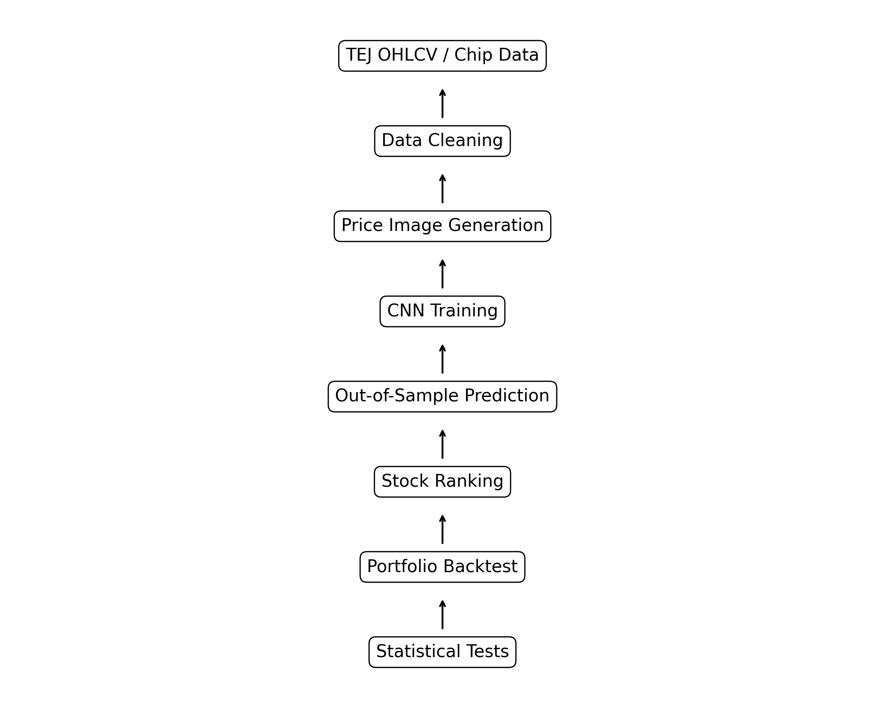
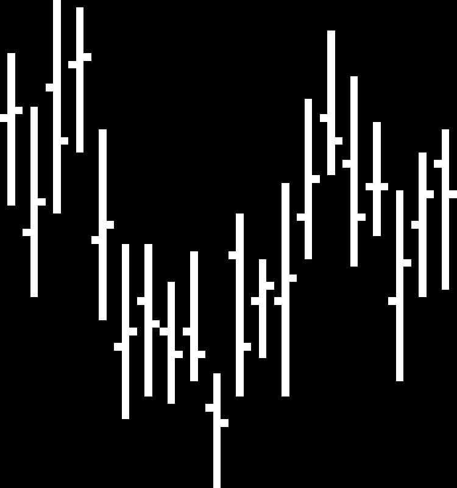

# 台股價格影像 CNN 量化研究

本專案參考價格影像方法，將台股 OHLCV 資料轉換為價格圖像，使用 CNN 預測未來報酬方向，並將模型預測分數轉換為橫斷面股票排序策略。

本研究不以 AUC 作為唯一判斷依據。由於日頻股票方向預測通常只有微弱優勢，本專案進一步檢查模型分數是否能在樣本外形成穩定的投資組合排序，並以 D10-D1 多空績效、t-stat、bootstrap 隨機排序檢定、不同 seed 與交易成本後績效進行驗證。

---

## 1. 研究問題

本研究想回答：

> 台股歷史價格影像是否包含可被 CNN 擷取的微弱橫斷面排序訊號？

若 CNN 學到有效訊號，則模型預測分數較高的股票組合，未來報酬應系統性高於模型預測分數較低的股票組合。

---

## 2. 研究流程

資料清理  
↓  
價格影像生成  
↓  
CNN 訓練  
↓  
樣本外預測  
↓  
股票排序  
↓  
投資組合建構  
↓  
交易成本扣除  
↓  
績效與統計檢定  

---

## 3. 資料與樣本切割

| 項目 | 設定 |
|---|---|
| 市場 | 台灣上市櫃股票 |
| 資料來源 | TEJ 復權 OHLCV 資料 |
| 訓練期間 | 2008–2017 |
| 測試期間 | 2018–2025 |
| 預測目標 | 未來 5 日報酬方向 |
| 標籤定義 | 未來報酬 > 0 為 1，否則為 0 |
| 交易成本 | 單邊 5 bps |
| 缺值處理 | 視窗內含 NaN 則不加入樣本 |

注意：TEJ 為授權資料，本 repo 不包含原始行情資料，只提供程式碼、實驗設定、樣本輸出與結果摘要。

---

## 4. 價格影像設計

| 元素 | 設計 |
|---|---|
| 背景 | 黑色 |
| 線條 | 白色 |
| 每日寬度 | 3 pixels |
| Open | 左側 |
| High-Low | 中間垂直線 |
| Close | 右側 |
| 視窗 | 20 或 60 交易日 |
| 圖像高度 | 64 或 96 pixels |

樣本影像：

---

## 5. 策略規則

每個再平衡日：

1. 使用 CNN 對每檔股票產生未來報酬為正的預測機率。
2. 將股票依照預測機率由低到高排序。
3. 分成十組：
   - D1：模型最不看好的股票
   - D10：模型最看好的股票
4. 建立多空組合：
   - Long D10
   - Short D1
5. 每組內股票採等權重。
6. 持有 5 個交易日。
7. 扣除單邊交易成本 5 bps。
8. 計算年化報酬、Sharpe、最大回撤、勝率、t-stat 與 bootstrap p-value。

---

## 6. 主要結果

| 模型 | AUC | D10-D1 年化報酬 | Sharpe | MDD | t-stat | bootstrap p-value |
|---|---:|---:|---:|---:|---:|---:|
| OHLC 單通道 | 待填 | 待填 | 待填 | 待填 | 待填 | 待填 |
| OHLC + MA | 待填 | 待填 | 待填 | 待填 | 待填 | 待填 |
| Chen 雙通道 | 待填 | 待填 | 待填 | 待填 | 待填 | 待填 |
| 三通道籌碼 | 待填 | 待填 | 待填 | 待填 | 待填 | 待填 |

完整結果請見 `reports/main_results.csv`。

---

## 7. 統計檢定

由於模型 AUC 約落在 0.51–0.53，代表模型僅具有微弱方向預測能力，因此本研究不單獨依賴 AUC 判斷策略有效性。

本專案進一步檢查：

1. D10-D1 平均報酬是否顯著大於 0。
2. 模型排序是否優於隨機排序。
3. 不同 seed 下結果是否穩定。
4. 不同測試期間下結果是否一致。
5. 扣除交易成本後是否仍有績效。

---

## 8. 專案限制

1. AUC 僅代表方向分類能力，不能直接等同於交易績效。
2. D10-D1 為研究型投資組合，實務交易仍需進一步處理流動性、下單限制、放空限制與風控。
3. 本研究目前尚未完整納入即時滑價與市場衝擊。
4. 由於 TEJ 資料授權限制，repo 不提供原始行情資料。
5. 後續需進一步加入 walk-forward retraining 與更嚴格的樣本外檢驗。
